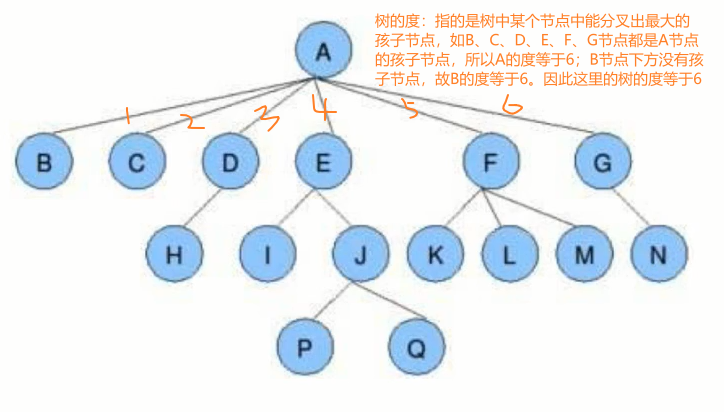
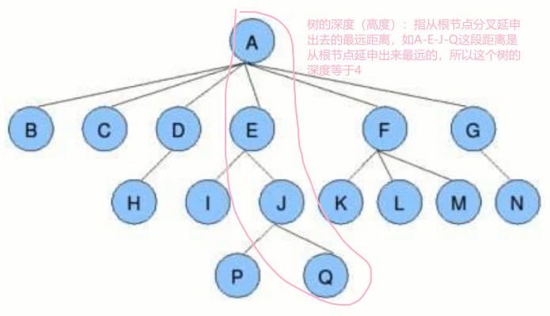
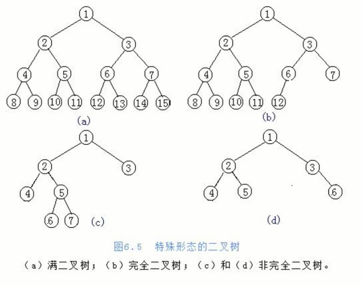
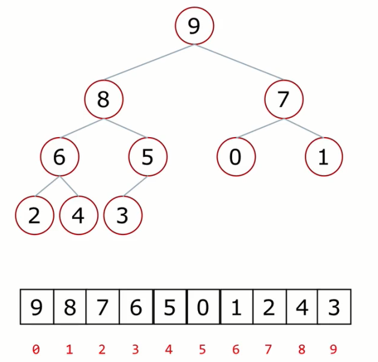

# 数据结构

+ 树

## 树

- 树是一种数据结构，如目录结构
- 树是一种可以递归定义的数据结构
- 树是由`n`个节点组成的集合：
  - 如果`n = 0`, 那这是一颗空树
  - 如果`n > 0`，那存在1个节点作为树的根节点，其他节点可以分为m个集合，每个集合本身又是一棵树

### 概念

> - 根节点、叶子节点
> - 树的深度（高度）
> - 树的度
> - 孩子节点/父节点
> - 子树
> 
> **根节点**：树里边的**第一个节点**，其余的节点均是由其分叉延申得到的；
> **叶子节点**：树里边的某个节点没有在进行分叉，该节点已经是最末端，如下图；![[根节点 & 叶子节点.png]]
> 
> **树的度**：指的是树中某个节点分叉出最多的孩子节点，树中最大的**节点的度**，节点的度指的是某节点向下分叉了几个孩子节点，如图
> 
> 
> **树的深度**：指的是从根节点分叉延申出去的最远距离，如下图树的深度等于4   

> 
> **孩子节点/父节点**：从节点分叉出去的节点称为**孩子节点**，如上图中的`I`和`J`就可以称为`E`的孩子节点，而**E就是I和J的父子节点**。
> 
> **子树**：指的是除去根节点后形成的树，如`E-I、E-J-P-Q`就可以称为子树。

### 二叉树

- 二叉树：度不超过2的树
- 每个节点最多有两个孩子节点
- 每个孩子节点被区分为左孩子节点和右孩子节点

#### 满二叉树

满二叉树：一个二叉树，如果每一层的节点数都达到了最大值，则这个二叉树就可以称为满二叉树

#### 完全二叉树

完全二叉树：叶子节点只能出现在最下层和次下层，并且最下面一层的节点都集中在该层最左边的若干位置的二叉树

#### 二叉树的存储方式

- 链式存储方式
    `**#TODO 待学习**`
    

- **顺序存储方式**
	假设将一颗完全二叉树用列表的格式进行存储，即将根节点、子节点存储到列表中，如：
  
    
    
    有一颗**根节点是9**的完全二叉树（大根堆，即父节点比孩子节点大），根节点下面**分叉出了两个孩子节点8和7**，节点8下面又分叉出了两个孩子节点6和5，节点7下面也分叉出两个孩子节点1跟0。将该完全二叉树用列表按照顺序的方式进行存储，如何存储每个节点的信息呢？父节点与左孩子节点的联系`0-1,1-3,2-5,3-7,4-9`，父节点与右孩子节点的联系`0-2,1-4,2-6,3-8,4-10`。查看并分析父节点与左右孩子节点的下标可以发现父节点与左孩子节点的关系：`i -> 2i+1`，与右孩子节点的关系`i -> 2i+2`。即父节点在列表中的下标为`n`时，左孩子节点的下标等于`2n + 1`，右孩子节点的下标等于`2n + 2`。又假如从孩子节点找父节点，孩子节点又分为左右孩子节点，假设左孩子节点在列表中的下标等于`m`，右孩子节点等于`m + 1`，那么父节点在列表中的下标应该等于`(m-1)//2`。左孩子节点在列表中下边肯定是一个奇数，右孩子节点必定是一个偶数，且在编程运算中`整除//`仅会返回商的结果，根据先前得到的父节点找孩子节点的公式`2n+1,2n+2`，对公式进行逆推，可以得到父节点在列表中的下标等于`(m-1)//2`，如做右孩子节点的下标是7，8时它们的父节点下标等于(7-1)//2=3,(8-1)//2=3。
